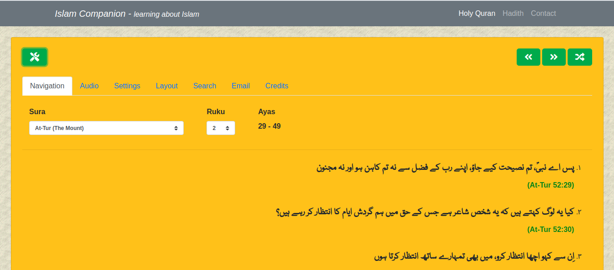

### Introduction
The "**Islam Companion Web API**" project is a RESTFul API (Application Programming Interface) that allows users to add Holy Quran and Hadith data to their applications.

It provides Holy Quran translation in 42 languages. Following languages are supported: **Amharic, Arabic, Bosnian, Bengali, Bulgarian, Amazigh, Czech, German, Divehi, Spanish, English, Persian, French, Hindi, Hausa, Indonesian, Italian, Japanese, Korean, Kurdish, Malayalam, Malay, Dutch, Norwegian, Portuguese, Polish, Russian, Romanian, Swedish, Somali, Sindhi, Albanian, Swahili, Turkish, Tajik, Tamil, Tatar, Thai, Uzbek, Urdu, Uyghur and Chinese**.

Hadith translation is provided in **Urdu, English and Arabic languages**.

The goal of the Islam Companion Web API is to help users develop applications that promote knowledge about Islam.

### Features
The Islam Companion Web API has the following features:

* It provides translations of Holy Quran in 42 languages
* It provides translations of Hadith in Urdu, English and Arabic languages
* It provides 8 API functions for fetching Quranic data
* It provides 7 API functions for fetching Hadith data
* The source code is available under [GPL License](https://github.com/pakjiddat/islamcompanion-web-api/blob/master/LICENSE)
* The source code is well commented and easy to update

### Requirements
The Islam Companion Web API requires PHP >= 7.2. It also requires MySQL server >= 5.6.

### Installation
The following steps can be used to install the "Islam Companion Web API" project on your own server:

* Download the [source code](https://github.com/pakjiddat/islamcompanion-web-api/archive/master.zip) from GitHub
* Move the source code to the document root of a virtual host
* Download the contents of the database from: [here](https://drive.google.com/open?id=1Lq0xjVPiTso1io-uhKxz7aT7McIlBwj6)
* Extract the downloaded file
* Create a database and import the contents of the SQL file to the database. Note down the credentials used for connecting to the database
* Enter the database credentials in the file **api/config/RequiredObjects.php**
* In the file: **api/Config.php**, on **line 37** enter the domain names that will be used to access the API
* Customize the following variables in the file: **api/config/General.php**. **$config['app_name'], $config['dev_mode'] and $config['site_url']**

### Download data

* [Click here](https://drive.google.com/file/d/1gd8B0C-N7LcppMNikv1FNQoL_XJ2nuQv/view?usp=sharing) to download the Hadith database in **.sql** format for MySQL server.
* [Click here](https://drive.google.com/file/d/1pHo5auUuKiNEi9jlmQJ0-n3oqDEdbDR0/view?usp=sharing) to download the Hadith database in **.db** format for SQLite server.
* [Click here](https://drive.google.com/file/d/16BdoFFoi2Vic6eDDqtk72DRppgTWCFI7/view?usp=sharing) to download the Quranic database in **.db** format for SQLite server.

### Frequently asked questions

* **What is the Islam Companion Web API**. It is a RESTFul API for accessing Holy Quran and Hadith data
* **What can I do with the Islam Companion Web API**. You can develop web based applications that present Holy Quran and Hadith data to the user. The Islam Companion API can work as the back-end of your application.
* **Which languages are supported by the Islam Companion Web API**. [Click Here](#introduction)
* **What functions are provided by the Islam Companion Api**. Please read the documentation.
* **From where does the API get its data**. The Islam Companion API uses Holy Quran translations from [http://tanzil.net/trans/](http://tanzil.net/trans/). It uses Hadith data from [http://hadithcollection.com/](http://hadithcollection.com/) and [https://www.quranurdu.com/Ahadith/](https://www.quranurdu.com/Ahadith/).
* **How do I use the API**. To use the API, you have to make HTTP POST request to your server. Please see following sample code in PHP language.

### Sample Code

```php
<?php

$data = array(
    'language' => 'English',
    'narrator' => 'Mohammed Marmaduke William Pickthall'
);

// Prepare new cURL resource
$ch = curl_init('https://your-host-name/api/get_random_verses');
curl_setopt($ch, CURLOPT_RETURNTRANSFER, true);
curl_setopt($ch, CURLINFO_HEADER_OUT, true);
curl_setopt($ch, CURLOPT_POST, true);
curl_setopt($ch, CURLOPT_POSTFIELDS, $data);

// Submit the POST request
$result = curl_exec($ch);

// Close cURL session handle
curl_close($ch);

// json decode the response
$result = json_decode($result, true);

// Print the result
print_r($result);
?>
```

### Usage
The Islam Companion Web API supports the following functions. All function response values are in JSON format.
To test the API, use the following url: [https://your-host-name/api/](https://your-host-name/api/) for making API requests. All API requests must be of type HTTP POST and should include the required API parameters.

[API calls for fetching Holy Quran data](https://github.com/pakjiddat/islam-companion-web-api#api-calls-for-fetching-holy-quran-data)

[API calls for fetching Hadith data](https://github.com/pakjiddat/islam-companion-web-api#api-calls-for-fetching-hadith-data)
