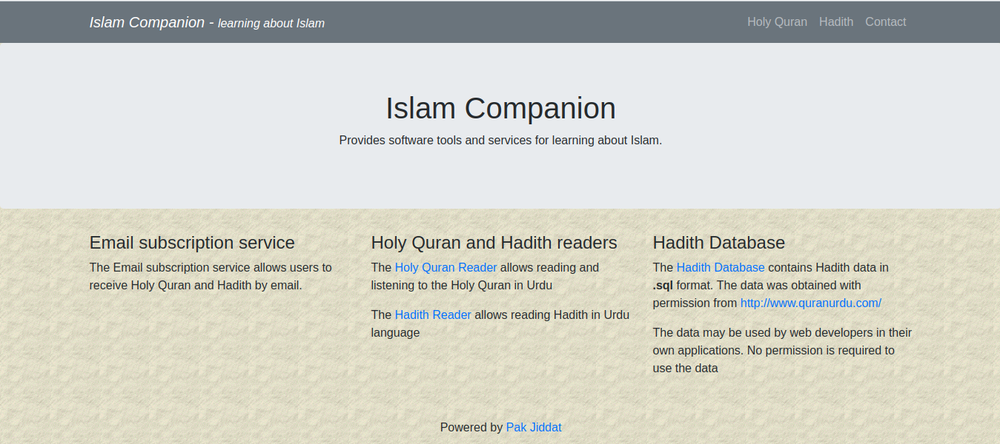

### Introduction
The **Islam Companion website** project is a website that allows users to read Holy Quran and Hadith text. It also allows users to subscribe to Holy Quran and Hadith by email.

The goal of the Islam Companion website is to provide a basic website that displays Holy Quran and Hadith data. The user may customize this website according to their requirements.

### Features
The Islam Companion website has the following features:

* It has a reader that displays Holy Quran verses
* It has a reader that displays Hadith text
* It allows users to get Quranic verses and Hadith by email
* It allows downloading Hadith database in **.sql** format
* It allows users of the website to send a message to the website administrator
* The source code is available under [GPL License](https://github.com/pakjiddat/islam-companion-website/blob/master/LICENSE)
* The source code is well commented, modular and easy to update

### Limitations
The Islam Companion website has the following limitations:

* The Islam Companion website was designed using JavaScript modules which are not supported by older browsers

### Requirements
The Islam Companion website requires PHP >= 7.2. It also requires MySQL server >= 5.6. For sending emails, the website requires the [Mail](https://pear.php.net/package/Mail/) and [Mail Mime](https://pear.php.net/package/Mail_Mime/) pear packages.

### Installation
The following steps can be used to install the "Islam Companion" project on your own server:

* Download the [source code](https://github.com/pakjiddat/islam-companion-website/archive/master.zip) from GitHub
* Move the source code to the document root of a virtual host
* Download the contents of the database from: [here](https://drive.google.com/open?id=1Lq0xjVPiTso1io-uhKxz7aT7McIlBwj6)
* Extract the downloaded file
* Create a database and import the contents of the SQL file to the database. Note down the credentials used for connecting to the database
* Enter the database credentials in the file **islamcompanion/config/RequiredObjects.php**
* In the file: **islamcompanion/Config.php**, on **line 32** enter the domain names that will be used to access the website
* Customize the following variables in the file: **islamcompanion/config/General.php**. **$config['app_name'], $config['dev_mode'] and $config['site_url']**
* Customize the variables in the file: **islamcompanion/config/Custom.php**. The comments explain what each variable is used for
* Set the **$config['pear_folder_path']** variable in the file: **islamcompanion/config/Path.php**. The variable should be set to the path of the [pear](https://pear.php.net/) installation.
* Visit the website in a browser
* The layout and text of the website can be edited in HTML files inside the folder: **islamcompanion/ui/html**. For example to edit the website header, the file: **islamcompanion/ui/html/base/header.html** needs to be edited
