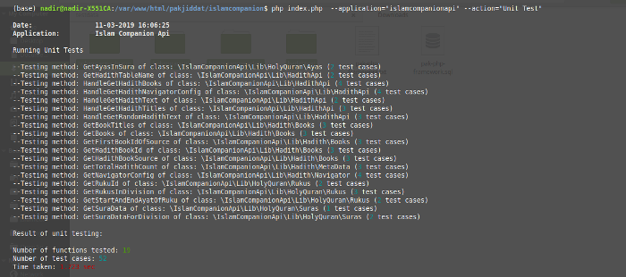

### Introduction
The Pak Php Framework is a framework for developing PHP applications. It can be used to develop command line applications as well as browser applications based on [Model View Controller (MVC) design pattern](https://en.wikipedia.org/wiki/Model%E2%80%93view%E2%80%93controller).

An application framework provides libraries and tools for developing applications. The Pak Php framework provides error handling, function validation, log handling, session handling, URL request handling based on MVC design pattern, URL routing, translation and testing. It also includes utility classes that provide commonly used features such as Template Engine, Database Abstraction, Error Handling, File and Folder management and more.

The utility classes and features provided by the Pak Php Framework are implemented as separate components that are easy to extend. All components of the Pak Php Framework are based on the principles of [Separation of concerns](https://en.wikipedia.org/wiki/Separation_of_concerns) and [Don't repeat yourself](https://en.wikipedia.org/wiki/Don%27t_repeat_yourself).

Third party frontend libraries such as [Twitter Bootstrap](https://getbootstrap.com/), [JQuery](https://jquery.com/), [W3.CSS](https://www.w3schools.com/w3css/) etc can be integrated with the Pak Php Framework.

### Requirements
The Pak Php Framework requires Php 7.2 and above. The code for the Pak Php Framework is fully commented and compliant with the [PSR-2](https://www.php-fig.org/psr/psr-2/) coding guidelines. Parameter and return types are given for all methods.

The Pak Php Framework does not have any external dependencies apart from the XDebug PHP extension. It has its own Template Engine and Test Manager. It provides a simple framework for developing well tested applications.

### Development of the website
The website was developed by following the [Lean Startup principles](http://theleanstartup.com/principles). The book [Understanding Software](https://www.packtpub.com/business/understanding-software) was an invaluable guide in the development of the framework.

The goal of the Pak Php Framework is to provide a light weight set of tools for developing professional, well tested web applications. Applications developed using the Pak Php Framework should be based on Lean Startup principles.

### Application Structure
A single instance of the Pak Php Framework can support several applications. Each application must be in its own folder. The following shows the structure of a sample Pak Php Framework application:

```
├── config
│   ├── Custom.php
│   ├── General.php
│   ├── Path.php
│   ├── RequiredObjects.php
│   ├── Test.php
│   └── Callables.txt
├── Config.php
├── lib
├── test
│   └── results
│       ├── codecoverage
│       └── tracelogs
└── ui
    ├── css
    ├── html
    ├── images
    ├── js
    ├── pages
```

The config folder holds the application configuration files. Each file should contain a single method called **GetConfig**. This method should return an array containing configuration data, which overrides the default framework configuration. See the folder **framework/config**, for the default configuration files.

The **Custom.php** file can contain custom configuration. The **Callables.txt** file defines the URL routing information for the application.

The **lib** folder should contain the user defined library files. The **ui** folder contains the user interface related code. It should contains the sub folders shown in the above example. The **css** sub folder contains application CSS files, the **images** folder contains application image files, the **js** folder contains application JavaScript files. The **html** folder contains the HTML template files. The **pages** folder should hold files that derive from the **\Framework\Application\Page** base class.

### Framework Structure
The Pak Php Framework has the following structure:

```
├── autoload.php
├── index.php
├── .htaccess
├── framework
│   ├── application
│   │   ├── Api.php
│   │   ├── Application.php
│   │   ├── CommandLine.php
│   │   ├── libraries
│   │   │   ├── ErrorHandling.php
│   │   │   ├── FunctionValidation.php
│   │   │   ├── LogHandling.php
│   │   │   ├── SessionHandling.php
│   │   │   ├── Translation.php
│   │   │   └── UrlRouting.php
│   │   ├── Page.php
│   │   └── Web.php
│   ├── config
│   │   ├── base
│   │   │   ├── GeneralConfig.php
│   │   │   ├── PathConfig.php
│   │   │   ├── RequiredObjectsConfig.php
│   │   │   └── TestConfig.php
│   │   ├── Config.php
│   │   ├── Initializer.php
│   │   └── Manager.php
│   ├── documentation
│   │   └── changelog.txt
│   ├── templateengine
│   │   ├── BasePage.php
│   │   ├── Generator.php
│   │   └── HeaderTags.php
│   ├── testmanager
│   │   ├── BlackBoxTesting.php
│   │   ├── CodeCoverageGenerator.php
│   │   ├── TestDataManager.php
│   │   ├── TestFunctionProcessor.php
│   │   ├── TestFunctionValidator.php
│   │   ├── TestResultsManager.php
│   │   ├── UiTesting.php
│   │   ├── UnitTestRunner.php
│   │   └── WhiteBoxTesting.php
│   ├── utilities
│   │   ├── Authentication.php
│   │   ├── autoload.php
│   │   ├── CacheManager.php
│   │   ├── commentmanager
│   │   ├── databasemanager
│   │   ├── documentation
│   │   │   └── changelog.txt
│   │   ├── Email.php
│   │   ├── Encryption.php
│   │   ├── errormanager
│   │   ├── examples
│   │   ├── Excel.php
│   │   ├── filesystem
│   │   ├── LogManager.php
│   │   ├── Profiler.php
│   │   ├── StringUtils.php
│   │   ├── TemplateUtils.php
│   │   └── UtilitiesFramework.php
│   └── vendors
```

#### Main entry point
The **index.php** file is the main entry point for the application. All URL requests are routed by the **.htaccess** file to the **index.php** file. The **autoload.php** file is used to autoload classes. All classes should have a name-space. The folder structure of a class should match the class name-space.

#### Application base classes
All Pak Php Framework applications are child classes of the **Application** base class, which is **application/Application.php**. Currently three types of applications are supported. API, Command Line and Web.

API applications extend the **Api** base class. Command Line applications extend the **CommandLine** base class. Web applications can extend either the Web class or the Page class. The Page class is derived from the Web class.

The main framework features which are URL Routing, Session Handling, Error Handling, Translation, Function Validation and Log Handling are implemented by classes in the **application/libraries** folder. Each feature is implemented separately from other features.

#### Configuration
Configuration is one of the main features of the Pak Php Framework. It allows class objects to be used without explicitly initializing the object. The user only has to mention the class once in **config/RequiredObjects.php**. For example:

```php
$config['contactpage']['class_name'] = '\PakJiddat\Ui\Pages\Contact';
```

The class can then be used using the syntax: **Config::GetComponent("contactpage");**. The framework takes care of initializing the class object. If the object has already been created, then it is simply returned. All classes are autoloaded using [PSR-4 autoloading standard](https://www.php-fig.org/psr/psr-4/).

Application data is stored in configuration files inside the folder: **config/**. See the [user application structure](#application-structure) for details. Configuration variables can be accessed using the syntax:

```php
Config::$config["general"]["dev_mode"]
```

The above code returns the current development mode of the application. If it is false, then application is in production mode.

#### Url Routing
The Pak Php Framework provides URL Routing. The user application should contain the file **config/Callables.txt**. This file specifies the callbacks for commands as well as callbacks for handling URL requests. An entry in the file has two parts. The first part starts with **url:** or **command:**. The second part starts with **callback:**.

The application should define an entry for each URL or pattern of URLs. The first line in the entry is a regular expression that defines which URLs to handle. The next line defines the callback function that should handle the URL request. The line after that defines an optional validator callback. This is the callback to be used for validating application parameters.

#### Command Line scripts
If the application has functions that are called from the command line, then each function should have an entry in **Callables.txt**, that starts with **command:**. The entry should specify the name of the command that needs to be entered by the user from the command line. The next line defines the callback function for handling the command. For example if an application defines the command "Generate Site Map", then it can be run with the command:

```php
php index.php --application=[app-name] --command="Generate Site Map"
```

The **Callables.txt** file should contain the entry:

```
command: Generate Site Map
callback: {"object": "websitetools", "function": "GenerateSiteMap"}
```

This entry means that the function **GenerateSiteMap** of the object "websitetools" will be called, when the command "Generate Site Map" is entered. The config file: **config\General.php**, should contain the following line:

```php
/** The custom commands */
$config['commands'] = array("Generate Site Map (generates site map of website)");
```

The above command defines the commands implemented by the application. These commands are shown to the user when he enters the command:

```php
php index.php --application=[app-name] --command="Help"
```

This command lists all commands supported by the application.

The following code shows sample contents of the **Callables.txt** file:

```
url: ^/$
callback: {"object": "homepage", "function": "Generate"}

url: ^/articles(/view/\d+/[A-Za-z\-0-9\._%]+)?$
callback: {"object": "viewarticlepage", "function": "Generate"}

url: ^/articles/(tag|search)/[a-z\-0-9A-Z\._%]+?$
callback: {"object": "listarticlepage", "function": "Generate"}

url: ^/contact/form$
callback: {"object": "contactpage", "function": "Generate"}

url: ^/contact/add$
callback: {"object": "contactpage", "function": "SendContactMessage"}

command: Generate Site Map
callback: {"object": "websitetools", "function": "GenerateSiteMap"}
```

#### Template Engine
The Pak Php Framework includes a template engine which allows user applications to merge application data with HTML templates

#### Test Manager
The Pak Php Framework provides classes for testing code. Three types of tests are supported. [White Box tests](https://en.wikipedia.org/wiki/White-box_testing), [Black Box tests](https://en.wikipedia.org/wiki/Black-box_testing) and Ui (user interface) tests.

White Box tests are written like [PhpUnit](https://en.wikipedia.org/wiki/PHPUnit) tests. The user defines test methods in a file. Each method name should start with "Test". The test is then run from the command line. Assert statements may be used within the test methods to validate conditions.

Black Box tests are written by defining test data inside test files. Each method has its own test data file. The first line in the test data file gives the list of parameters separated by '|'. The last three entries in the first line gives the expected return value, the type of the return value and the rule used to validate the return value. The test data file can be auto generated for each method defined by the application. The command:

```php
php index.php --application="[app-name]" --action="Generate Test Data"
```

will generate test data files for each user defined method. The test data files will be placed in the folder: **test/testdata/{class-name}**. The name of the file is same as the name of the method. Following is a sample structure of a test data file:

```
param_int_name1|param_int_name2|param_int_name3|return_name1|return_type|rule
1|1|7|{"count":7}|array|count
```

A UI (user interface) test allows the HTML of the response to be checked for errors. The [validator.nu](https://validator.nu/) service is used to check if the HTML conforms with the HTML5 standard. Broken links are also checked as part of the Ui test. The test data for the Ui test is defined in a database table. See the structure of the table: **pakphp_test_data**. It has two main fields which are the URL and URL parameters. This data may be auto generated by setting the **save_ui_test_data** variable to **true** in **config/Test.php**. When this option is set to true, the framework saves the current URL and parameters to database

After a black box or white box test has been run, code coverage information for the test is displayed on the console and also saved to database. A summary of the test results is saved to database and file. A trace log of all function calls is also saved. The code coverage and function trace are generated using XDebug. The following screenshot shows the test results that are printed to the console after running black box tests:



The following screenshot shows the code coverage summary after running black box tests:


#### Utilities
The utilities folder contains classes that provide utility functions. These classes are used by the framework and may be used in user applications. See the [Utilities Framework](/posts/utilities-framework) package for information on how to use the utility classes.

#### Vendors
The vendors folder contains third party libraries such as [Twitter Bootstrap](https://getbootstrap.com/), [JQuery](https://jquery.com/), [W3.CSS](https://www.w3schools.com/w3css/) and [QUnit](https://qunitjs.com/). These frontend libraries can be used in html templates. Reusable widgets may be developed that allow developers to easily create attractive looking applications.

#### Installation
* Run the command:

```bash
composer require nadirlc/pak-php-framework (Installation using Composer) OR
git clone https://github.com/pakjiddat/pak-php-framework.git (Download from [GitHub Repository](https://github.com/pakjiddat/pak-php-framework))
```

After the source code has been downloaded, create a MySQL database called **pakjiddat_pakphp** and import the contents of the file **framework/data/pak-php-framework.sql** to the database. This will create the database tables used by the Pak Php Framework. These tables are used for saving error data, access logs, test data and test results.

### Examples
The **helloworld** sample application shows how to get started with the Pak Php Framework. To run the application, enter the name of the host used to access the application in the **helloworld/Config.php** file. Replace **example.pakjiddat.pk** with **your-host-name**. Also enter the database server credentials in **helloworld/config/RequiredObjects.php**. After that open the application in the browser.

For a more complex example you can download and install one of the following:

* [Developers Site](https://github.com/pakjiddat/developers-site). It is a simple website that allows web developers to publish their work
* [Islam Companion Website](https://github.com/pakjiddat/islam-companion-website). It allows users to read the Holy Quran and Hadith. Also allows subscribing to Holy Quran and Hadith by email
* [Islam Companion Web API](https://github.com/pakjiddat/islam-companion-web-api). It provides a RESETFul API for fetching Holy Quran and Hadith data
