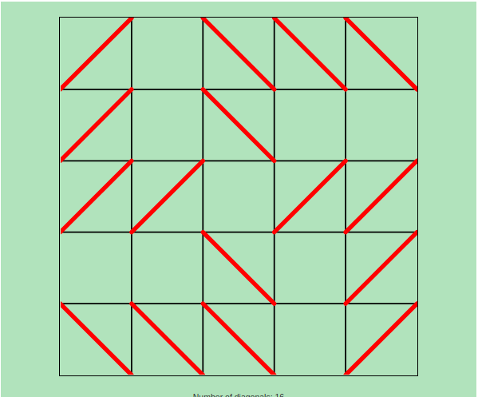

### Introduction

I took the [What is a proof](https://www.coursera.org/learn/what-is-a-proof) course on [Coursera](https://www.coursera.org/) and found it very useful. The course provides useful knowledge about mathematical proofs. I found the course very useful and interesting. In this article I will describe one of the problems that were given to the students to solve.

In the N Diagonal problem, we have a board containing NxN squares. Each square can have 2 diagonals, but the diagonals of neighboring squares should not intersect. A square can have three possible states. Either empty, a left diagonal or a right diagonal. We need to find out if it is possible to have X number of diagonals.

### Solution Overview

We have to go one step at a time, from the bottom left square and from left to right. A square can have 3 possible values. 0, 1 and 2. 0 means empty, 1 means diagonal is from right to left. 2 means diagonal is from left to right.

We can use a list to store the square values in Python. Python does not have built in support for arrays, so we can use a list instead.

First we need to find all possible values that a square can have. Since each square has three possible values, there are many possible combinations of values of a squares neighbors.

We can instead check if there is some combination of neighbor values which makes it impossible for the square to have a value of 1. Similarly we need to check if there is some combination of neighbor values which makes it impossible for the square to have a value of 2.

A square cannot have a value of 1 if the left square has a value of 2 or bottom square has a value of 2 or bottom right square has a value of 1.

A square cannot have a value of 2 if the left square has a value of 1 or bottom square has a value of 1 or bottom left square has a value of 2.

### Pseudo Code

Here is the pseudo code:

```
function SolveNDiagonal(n, diag_count, arr, index):
    if sum of 1s and 2s in list is more than N, then 
        print list
        exit

    For each x in arr starting from index upto NxN
        values = GetPossibleValuesOfSquareAtX(n, arr, x)
    For each val in values, 
        if val is  more than 0, then
            SolveNDiagonal(n, diag_count, arr, index+1)
            
The function is called as follows:

SolveNDiagonal(n, diag_count, arr, 0)
```

Where **n=5**, **diag_count=16**, **arr** is a Python list initialized with **0s**. The last parameter is the starting index, which is **0**.

### Source code in Python

```python
# Main function
# n is the number of rows or cols in the board
# diag_count is the required number of diagonals
# arr is a list of size NxN
# index is the starting position
# The function prints state of all squares on the board
# Such that the board has diag_count number of diagonals
def solve_n_diagonal(n, diag_count, arr, index):    
 
  if (arr.count(1) + arr.count(2)) == diag_count:
    print("Solved for n = " + str(n) + 
            " and diagonal count = " + str(diag_count))    
    print(arr)
    exit()
              
  for x in range(index, n*n):
    values = get_element_values(n, arr, x)
    for val in values:
      arr[x] = val
      if val > 0:
        solve_n_diagonal(n, diag_count, arr, x+1)
        
# The values of neighboring squares
# We are only concerned with the values of squares on the
# left, bottom, bottom right and bottom left         
def get_neighbor_values(n, arr, x):
  neighbor_values = {"left": -1, "bottom_right": -1, "bottom_left": -1, 
                     "bottom": -1}
  if x % n != 0:
    neighbor_values["left"] = arr[x-1]
  if x >= n and (x % n != n -1):
    neighbor_values["bottom_right"] = arr[x-(n-1)]
  if x >= n and (x % n != 0):
    neighbor_values["bottom_left"] = arr[x-(n+1)]      
  if x >= n:   
     neighbor_values["bottom"] = arr[x-n]      
     
  return neighbor_values
  
# Get the possible values that the square at position x can have
# The possible values are returned in a list
def get_element_values(n, arr, x):  
  neighbor_values = get_neighbor_values(n, arr, x)
  
  values = list()
  
  is_one_valid = True
  is_two_valid = True
  
  if (neighbor_values["left"] == 2 or neighbor_values["bottom"] == 2
    or neighbor_values["bottom_right"] == 1):
    is_one_valid = False
  if (neighbor_values["left"] == 1 or neighbor_values["bottom"] == 1
    or neighbor_values["bottom_left"] == 2):
    is_two_valid = False  
    
  if is_one_valid:
    values.append(1)
  if is_two_valid:
    values.append(2)
    
  values.append(0)
  
  return values
  
# Initialize a list of size n*n with 0s  
def initialize_array(n):
  arr = list()
  for x in range(n*n):
    arr.append(-1)
  
  return arr
     
# The number of rows or cols in the board      
n = 5
# The required number of diagonals
diag_count = 16
# The list is initialized
arr = initialize_array(n)
# The main function is called
solve_n_diagonal(n, diag_count, arr, 0)
```

The above code prints the state of each square on a board, such that a square is either empty or it has a diagonal which does not intersect with the diagonals of its neighboring squares.

