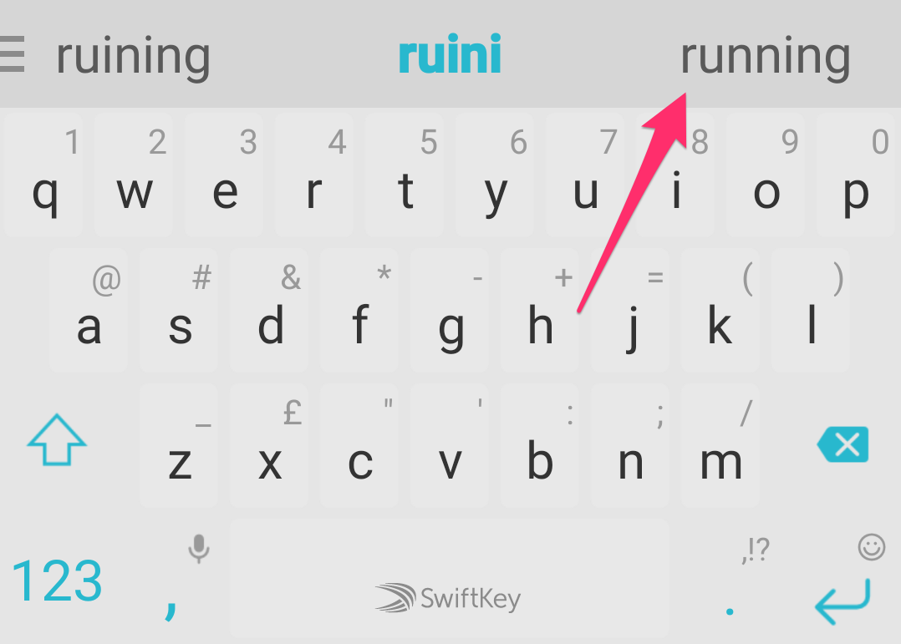

### Introduction
N-gram models have applications in many areas such as spell checking, biological sequence analysis, speech recognition, word prediction and more. In this article I will provide an overview of n-gram models. I will first describe n-gram models and how they are used to predict words. Next I will describe the steps involved in developing n-gram models for word prediction.

### What are n-grams
[N-grams](https://en.wikipedia.org/wiki/N-gram) are sequences of items such as letters, words, phonemes, syllables etc. The 'n' in n-grams refers to the number of items in the sequence. For example the term "4-gram words" refers to four words that occur in sequence.

### The n-gram language model
A statistical language model assigns probabilities to a sequence of words. A n-gram language model is based on the Markov assumption that the probability of a word depends only on the probabilities of the previous words. Smoothing techniques are used to assign probabilities to unknown words.

Two benefits of n-gram models are that they are simple and scalable in the sense that they can be developed using small data sets and then applied to data sets of large sizes.

Maximum likelihood estimation (MLE) is used to determine the probability of words in a n-gram model. The probability of a word in a n-gram model is given by P(w) = count(w)/count(wprev), where w is the word and wprev is set of the previous words. count(w) is the number of times the n-gram occurs. count(wprev) is the number of times the (n-1) gram occurs.

### Predicting words using n-gram models
It is possible that a language model does not have the information required to determine the probability of a given word and set of previous words. In this case the language model may refer to lower level n-grams. For example if a 4-gram model does not have data for a given word and previous words, then it may check a 3-gram model. If the 3-gram model also does not have the data for the given word and 2 previous words, then a 2-gram model may be checked. This is known as **back-off**.

Another options is to calculate the probability of the given word by taking a linear combination of all n-gram models. For example the probability given by each n-gram, n-1-gram, n-2-gram etc models is multiple by constants and added together. This gives a weighted probability for the given word. This method is called interpolation.

### Evaluating performance of n-gram models
To evaluate the performance of n-gram models intrinsic and extrinsic evaluation methods may be used. In extrinsic evaluation, the n-gram model is embedded into a particular application. The improvement in the application gives a measure of the model's performance.

It may not be feasible to embed a n-gram model into an application. An alternative is to measure the performance of the model independent of any application. This is called intrinsic evaluation. This can be carried out using [Perplexity](https://en.wikipedia.org/wiki/Perplexity). Perplexity is a quantitative measure of how perplexed or confused the language model is when required to predict the probability of a given set of words. A low Perplexity value, implies that the model is less surprised to learn about the given set of words. For n-gram models, Perplexity is equal to the nth root of the inverse of the product of probabilities of each word, given the previous words.

### Steps involved in generating n-gram language models
The following steps can be used to generate a n-gram language model from a given input text file:

#### Data Analysis
The first step is to analyze the given data. This involves determining various text statistics such as number of lines of text, word count, file size, type of textual content etc. This will give an idea of the size of the input data as well as the words and symbols that are not useful. This information will be used in the "Data Cleaning" step.

#### Data Sampling
The next step is to generate three sample files from the given input data file. These files are the train, validate and test files. The train file is used to generate the n-gram model. The validate file is used to evaluate the model's performance. The test file is used to run unit tests.

The data in these files needs to be non overlapping. For example the first 80% of the lines in the input data file can be used for the train file, the next 10% for the validation file and the last 10% for the test file. If the train and validation files contain the same data, then the model will predict data it already knows, which can result in overly exaggerated performance scores. This is known as over-fitting.

#### Data Cleaning
The next step is to remove unwanted symbols and words from the train file that was generated in the previous step. For example vulgar words, foreign words, punctuation symbols, non alphabetical symbols etc may be removed. Once the data has been cleaned, the next step is to generate n-gram tokens from the data.

#### Tokenization
In this step, the cleaned data file is read. N-grams tokens are extracted from the file and saved along with their frequencies to a new file. For example if the language model has a size of 4, then 4-gram, 3-gram, 2-gram and 1-gram tokens are extracted and saved to separate files along with their frequencies.

For example for the sentence: "today is a great day to go shopping", the 4-grams are: "today is a great", "is a great day", "a great day to", "great day to go", "day to go shopping". The 3-grams are: "today is a", "is a great", "a great day", "great day to", "day to go", "to go shopping". The 2-grams are: "today is", "is a", "a great", "great day", "day to", "to go", "go shopping". The 1-grams are simply the set of all words.

From the above example, we can see that the higher the n-gram size, the more information or context is provided. Each of the above n-grams are stored along with their respective frequencies, which is simply the number of times, the n-gram occurs in the entire document.

#### Generating transition probabilities
Each n-gram may be regarded as a set of prefix words followed by a next word. The probability of the next word given the prefix words is the transition probability of the word. It is calculated by dividing the number of times the n-gram occurs by the number of times the prefix words occur. Once the transition probabilities have been generated, they can be used to predict words and calculate Perplexity.

### Support for n-grams in R
R is a programming language that is well suited for performing tasks related to Data Science. A R package is software that performs a specific task. The packages [tm](https://cran.r-project.org/web/packages/tm/index.html) and [quanteda](https://cran.r-project.org/web/packages/quanteda/index.html) are frameworks for text processing. They provide functions for generating and analyzing n-gram tokens.

### The wordpredictor package
I had developed the [wordpredictor](https://github.com/pakjiddat/word-predictor) package as part of the [Data Science Capstone](https://www.coursera.org/learn/data-science-project) course on Coursera. The package allows generating and evaluating n-gram models. It also allows predicting words. A [DEMO application](https://pakjiddat.shinyapps.io/word-predictor/) shows how the wordpredictor package can be used to predict words.

