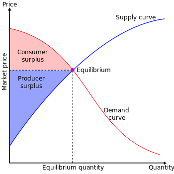

By User:SilverStar - Own work, CC BY 2.5, https://commons.wikimedia.org/w/index.php?curid=1450405

### Introduction
I recently took the [Microeconomics](https://www.coursera.org/learn/microeconomics) course on [Coursera](https://www.coursera.org/) and found it useful. As part of the course, we were given some practice questions related to producer and consumer surplus. In this article, I have listed these practice questions and my answers to the questions.

Producer and consumer surplus are used by economists to measure the total wealth of a society in a free market. In a free market trade is governed only by the principles of supply and demand. In this article I will describe what is meant by producer surplus, consumer surplus, total surplus, price ceiling and price floor. I will describe these terms along with examples and some related questions.

### Consumer surplus
According to the Wikipedia: [consumer surplus](https://en.wikipedia.org/wiki/Economic_surplus), is the monetary gain obtained by consumers because they are able to purchase a product for a price that is less than the highest price that they would be willing to pay.

The consumer surplus can be illustrated on a supply and demand curve. It is the area below the demand curve that is above the horizontal line that indicates the equilibrium price.

### Producer surplus
Wikipedia defines producer surplus as the amount that producers benefit by selling at a market price that is higher than the least that they would be willing to sell for; this is roughly equal to profit (since producers are not normally willing to sell at a loss and are normally indifferent to selling at a break-even price).

The producer surplus is indicated on a supply and demand curve, by the area above the supply curve that is below the horizontal line that indicates the equilibrium price.

### Total surplus
Total surplus is the sum of producer and consumer surplus.

### Price ceiling
Price ceiling is a government intervention policy that fixes the market price to a value that is less than or equal to the ceiling price. Price ceiling affects the consumer and producer surplus and hence the total surplus.

### Price flooring
Price flooring is a government intervention policy that fixes the market price to a value that is more than or equal to the floor price. Price flooring affects the consumer and producer surplus and hence the total surplus.

### How can we reduce the shortage of organs

#### Background
As we discussed in the lessons this module, advances in medical treatments have resulted in a dramatic increase in the number of organ transplants performed each year. A limited supply of organs, however, prevents many individuals from receiving organ replacements that could either save a life or substantially improve the recipient's quality of life. The Organ Procurement and Transplantation Network (OPTN) reports as of today (2/6/2012) there are 117,011 patients waiting for organs and only 11,663 organ donors.

In the U.S., all states have enacted a variation of the Uniform Anatomical Gift Act of 1968. Under this law, individuals are able to specify that some or all of their body may be donated after their death. The original version of this Act neither allowed, nor prohibited, the sale of human organs. The revised Uniform Anatomical Gift Act of 1987, however, prohibited the sale of human organs

#### Discussion Question
What type of policies would help shrink (or eliminate) the shortage of human organs? Use the concepts we learned this module to explain your answer.

#### Answer
The following types of policies can help to reduce shortage of human organs:

* Policies that promote development of artificial generation of human organs.
* Policies that allow human organs to be traded at a price subject to ethical rules. For example organs may be traded only if the organ donor is not alive.
* Policies may be formed regarding occupations that have health hazards. For example coal miners may be given the option of donating their organs in case of death during work.
* Policies that allow people to exchange each others organs for free or for a price. An ethical restriction could be that only those needing an organ are allowed to donate one of their other organs.
  
### Should we let price gauging takes place in times of natural disasters

#### Background
During times of crisis, particularly natural disasters, governments enforce strict rules (and penalties) to prevent price gauging. Price gouging is a pejorative term referring to a situation in which a seller prices goods or commodities much higher than is considered reasonable or fair. So, for instance, sellers of critical necessities such as water and gasoline are not allowed to hike up their prices right after a hurricane.

Nevertheless, as you learned in class, price ceilings tend to reduce social welfare by limiting the number of potential transactions. Someone has a higher incentive to load their pickup with water and drive to a hurricane-devastated area to sell it when they have the chance of charging a higher price for it.

#### Discussion Question
Do you think we should let price gauging take place in times of natural disasters? Again, please use the models and concepts discussed in the lectures to answer the question.

#### Answer
I think price gauging should be allowed in times of natural disasters, but it should be subjected to ethical rules. Consider the following two examples:

#### Example 1
For example in case of a natural disaster the quantity supplied of goods such as rice or flour may decrease. As a result the price of the goods will increase. Many low income consumers may not be able to afford the goods. If the goods are non essential, then the consumers can simple switch to a substitute good.

But if the goods are essential, such as water or some other good for which a substitute is not easily available, then the government should intervene and impose a price ceiling for the goods, so that it can be afforded by all.

#### Example 2
Consider another example. A disease breaks out in a country and the price of medicine or protective equipment increases. People are willing to pay more for the medicine and protective equipment. Also more people will want to buy. Sellers will sense this and will want to charge more. They should have the freedom to increase the price in order to satisfy the increase in demand for the medicine and protective equipment.

Because of the increase in demand, the demand curve will shift upwards and to the right. Because of this a new equilibrium price and quantity needs to be established, which will be at the intersection of the supply curve and the new demand curve. At this new equilibrium point, the sum of producer and consumer surplus, which is the total economic surplus is maximized.

The amount charged by sellers in many cases is not fair. For example misinformation can cause sellers to over price or under price an item. Also the price charged by sellers may be influenced by other factors such as their individual financial conditions or societal pressures. As a result supplier may not be able to correctly assess the demand for the goods.

As a result the amount charged by sellers may be fixed by local trade unions or the government. For example the government may impose a price ceiling on the sale of the medicine and protective equipment.

Although the intention of the price ceiling is to make the goods available for all, it has the adverse affect that the producer's surplus is reduced because they are being forced to sell at a lower price. If the seller is not happy, then the total economic welfare is reduced and society as a whole does not gain from the price ceiling.

I think these days the goods consumed by a country are produced all over the world, so there is no direct connection between producers and consumers. The quantity and price of supplied items depends on international trade. Governments can only influence their own producers, but not those of other countries. In case of natural disasters, having good international relations with other countries can be useful.

### Why is it so hard to find a cab in high crime neighborhoods

#### Background
Cab fares are usually regulated in most cities. For instance, in Chicago, where I live, cab drivers are not allowed to charge more than $2.25 for the first 1/9 mile, and $0.20 for each additional 1/9 mile. So, in effect, the city of Chicago imposes a price ceiling on the price of cab fares.

Nevertheless, as you learned in class, price ceilings tend to reduce social welfare by limiting the number of potential transactions.

#### Discussion Question
Do you think there is a relationship between the price ceiling for cab fares and the fact that it is very difficult to find cabs in high crime neighborhoods? Again, please use the models and concepts discussed in the lectures to answer the question.

#### Answer
In high crime neighborhoods, it is not easy for people to negotiate a price due to volatile economic conditions. An effective way to maximum welfare in society is to use price ceilings. When a price ceiling is in affect, both suppliers and consumers are aware of the market price before the transaction. There is less chance of disagreement, which can lead to crimes.

### Why do we only get peanuts on U.S. flights

#### Background
People always complain about the lack of complimentary meals in flights. And older people always tell stories of how in the "good old days" airlines used to serve full meals for free on their flights, and they also had more leg room between seats. But, also in the good old days airlines did not have much control over the price they charged for their flights. The U.S. government had strict regulations over the airline industry, including how much they could charge fliers. During those times it was hard for an airline to lower their prices without first getting permission from governmental authorities. So, in effect, the government used to impose a price floor on the market for air fare.

#### Discussion Question
Do you think there is a relationship between the price floor and the fact that today airlines offer fewer amenities than before? Furthermore, do you think air travel is better now (with fewer amenities) than before? Again, please use the models and concepts discussed in the lectures to answer the question.

#### Answer
Assuming that the price floor is less than the equilibrium price, having a price floor means supplier can continue to provide the airline service at the same equilibrium price. Hence producer surplus is not affected by the price floor.

Consumer surplus may decrease because some consumers may not be willing to pay at prices equal to or more than the price floor. So demand for airline travel will decrease. To increase demand for airline travel, airlines may adopt strategies such as serving full meals for free and providing more leg room between seats. As a result, consumers will be willing to pay more for airline travel. This may explain why airlines offered complimentary meals on flights in the "good old days".

I think airlines fares these days is much cheaper than it used to be. As a result consumer surplus is high and there is no need to provide extra amenities on flights such as complimentary meals.

### Why would an increase in the minimum wage lead to less unemployment

#### Background
In class this module we presented the traditional textbook explanation of the minimum wage. The minimum wage is a price floor that tends to increase unemployment by encouraging more workers to enter the labor force to compete for fewer jobs. Nevertheless, this theory has not been so easy to prove by looking at the data. Some studies, in fact, have proven it, but others have not. In fact, some studies have suggested an increase in the minimum wage could lead to less, not more unemployment.

#### Discussion Question
How could a price floor such as the minimum wage lead to less, not more, unemployment? Again, please use the models and concepts discussed in class to answer the question, and for purposes of this discussion, completely refrain from any moral or ethical arguments.

#### Answer
Unemployment implies a difference in demand for jobs and jobs available. In other words, there is a difference in quantity demanded and quantity supplied, which means that the market for jobs is not operating at the equilibrium point.

If the current price or wages are below the equilibrium point, then a price floor that is above the current market price but below the equilibrium price will result in a smaller difference in jobs demanded and jobs supplied. Hence there will be less unemployment.

### Should you stand in the line or pay someone to do it for you

#### Background
National Public Radio, NPR, reported the case of a person in China that earns his living by waiting in line for other people.

He is a "professional queuer". Last year, when Apple introduced its iPad Mini, news reported many instances where some people had paid others to stand in line for them to buy the iPad. For instance, in one high profile case, a man made $1,500 waiting in line to buy the iPad for someone else.

#### Discussion Question
Do you think these type of transactions increase or decrease social welfare? Suppose the government makes these types of transactions (charging someone to wait in line for them). Which groups in society are bound to lose the most as a result of this law?

#### Answer
 I think these type of transactions decrease social welfare. If the supplier had directly received the additional amount that the consumer was willing to spend, then the supplier would have increase the price of the item, which would increase the supplier surplus. An increase in the supplier's surplus would increase the total economic surplus.
 
 If the government passed a law making it illegal to pay someone else to stand in line, then this would adversely affect people who are mentally or physically incapable of standing in line, such as disabled people. It will also adversely affect unskilled people who can earn money by standing in line for other people.
