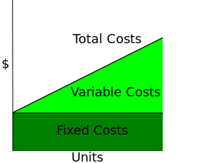

By Nils R. Barth - Self-made in Inkscape.This W3C-unspecified vector image was created with Inkscape ., Public Domain, https://commons.wikimedia.org/w/index.php?curid=3497302

### Introduction
I recently took the [Microeconomics](https://www.coursera.org/learn/microeconomics) course on [Coursera](https://www.coursera.org/) and found it useful. As part of the course, we were given some practice questions related to fixed costs and variable costs. In this article I will describe fixed costs and variable costs.

According to Investopedia [Variable Costs](https://www.investopedia.com/terms/v/variablecost.asp) are costs that change in proportion to how much a company produces or sells. In contrast, [Fixed Costs](https://www.investopedia.com/terms/f/fixedcost.asp) do not change with an increase or decrease in the volume of items produced or sold. Fixed costs have to be payed by the company irrespective of any business activity.

### What are fixed inputs and variable inputs for different industries

#### Background

The relative size of the fixed costs to variable costs varies considerably for different industries. It is important for a manager (or owner) to understand the differences between these cost categories. This discussion topic is designed to allow you to get better at understanding this difference.

#### Discussion Question

Consider 3 types of businesses/industries: 1) computer manufacturing, 2) computer software; and 3) pizzerias. What is the relationship between fixed costs and variable costs for each of these industries? Which 1 of these 3 industries has the largest share of fixed costs as a percentage of all costs?

#### Answer

1. Computer Manufacturing

For the Computer Manufacturing industry fixed costs are those costs which do not change with the number of computer parts that are produced or sold. Variable costs are costs which change with the volume of computer parts that are produced or sold.

Fixed costs may include rent, mortgage and lease payments for the production plant, salaries of staff that do not change with production such as manager salaries. Insurance and property taxes may also be regarded as fixed costs.

Variable costs include cost of labor, commission on sales of the computer parts, cost of raw materials used in production and utility payments such as electricity bills. Cost of packaging and depreciation of plant equipment are also variable costs.

2. Computer Software

For the software industry, fixed costs are those that do not change with the volume of software that is produced or sold. Variable costs include costs that change with the volume of software that is produced. The volume of software that is produced by software businesses depends on the number of software developers and measures taken to improve developer productivity.

Fixed costs would include license cost of operating systems, utility costs such as electricity bills, salary of managers. If the software is being developed in house, then payment of property taxes, office rent, office lease, insurance costs of computer equipment are also examples of fixed costs.

Variable costs would include the salary of software developers, cost of computer equipment, software licenses and cost of software and online services that increase developer productivity.

3. Pizzerias

Pizzerias are businesses that make pizzas. The fixed cost for Pizzerias are costs that do not change with the volume of pizzas that are produced. It would include rent, mortgage and lease payments for the kitchen where pizzas are made. The loans taken for payment of kitchen equipment. Salaries of managers. Payment of utility bills is also fixed because it does not change with the number of pizzas that are produced.

Variable costs for Pizzerias are costs that change with the volume of pizzas that are produced. Variable costs include salaries of cooks, cost of raw materials used to produce pizzas such as bread, cheese, cooking oil, vegetables, meat etc.

I think the computer manufacturing industry has the largest share of fixed costs as a percentage of all costs. Computer manufacturers in most cases can easily increase the number of units produced. This would not be possible if variable costs were high.

### What are the fixed costs and variable costs of MOOCs

#### Background

Companies like Coursera are dramatically changing higher education by offering good quality courses to the masses for a very low cost. But a more interesting question is why did it take so long? Perhaps the answer lies in the way technology has changed the fixed and variable costs of offering education in the last 10 years.

#### Discussion Question

What are the fixed and variable costs of offering a Coursera course? In what way have these costs changed during the last 10-15 years? How do these fixed and variable costs compare to the costs of offering a traditional face to face course for a typical 4-year college?

#### Answer

Massive Online Open Courses (MOOCs) is basically a video streaming provider. It may also offer software as a service, such as online software labs or applications. MOOCs provide a virtual learning environment at a very low cost.

Over the last 10-15 years there has been major improvements in computer technology. Computer parts such as Hard Drives and Processors cost much less and have much better performance. This has decreased the variable costs of providing online courses.

A MOOC that sells hundreds of courses online can sell thousands of courses without incurring a large variable cost. The same computer equipment can be used to serve many more courses.

This would mean that the cost of computer equipment and electricity is a fixed cost since it does not change with the increase or decrease in the number of courses that are offered. So I think over the last 10-15 years the fixed costs of offering a Coursera course has increased while the variable costs have decreased.

Typical colleges provide a physical learning environment at a high cost. Both MOOCs and colleges provide courses to students but at very different rates. Businesses that provide MOOCs and colleges have different types of fixed and variable costs.

For MOOCs and colleges, fixed costs are costs that do not change with the number of courses that are offered. Variable costs are costs that change with the number of courses that are offered.

For MOOCs fixed cost includes rent, mortgage and lease payments for the office buildings and manager salaries. Cost of video streaming equipment, cost of servers that provide software as a service and the license cost for software are also fixed costs.

For colleges the fixed costs would include rent, mortgage and lease payments for the college buildings and salaries of certain staff such as the college management.

For MOOCs, variable costs includes staff salary and payment to colleges that provide the online course material. The MOOC business may have its own data center. It may also use a cloud computing provider such as Google Cloud Platform or Amazon Web Services.

If the business has its own data center, then its variable cost may include the cost of running the data center. This would include utility costs, depreciation cost of data center equipment, license costs for the software and equipment. If the business uses a cloud computing provider, then its variable costs will include the subscription fees paid to the cloud computing provider.

For colleges variable costs are costs that change with the number of courses that are offered. This includes teacher salaries, cost of providing class rooms, utility costs, recreational services and facilities offered to students.

###  How long is the long run

#### Background

How long the long run is will vary from industry to industry.  

#### Discussion Question

How long would you estimate the long run is in the following industries

1. The market for soda sold from street carts in the Chicago Downtown district.
2. The market for meals at newly trendy Sushi restaurants.
3. The market for electrical engineers.
4. After 1999, the market for movies that are suspiciously similar to The Matrix?

#### Answer

1. The market for soda sold from street carts would exist for many years. Changes in the climate or customer preferences may cause the market to shutdown.

2. The market for meals at new trendy Sushi restaurants may exist for many years. Increase in fish prices or competition from other types of restaurants may cause Sushi restaurants to shutdown.

3. The market for electrical engineers is likely to remain for a very long time. Currently society depends a lot on electricity and there is a large market for electrical engineers.

4. The market for movies that are similar to Matrix would likely remain for a few years after the release of the Matrix movie. After that the theme of the movie may become outdated and the market may shutdown.

### What are different production functions for different firms

#### Background

Different firms have different production functions.

#### Discussion Question

Provide a brief description of the production function for each of the following firms. What is the firm's output? What input does it use? Can you think of any special features of the way production takes place in a firm?

1. An Iowa wheat farm
2. An Arizona vegetable farm
3. A local arc-welding farm
4. Apple Computers
5. Macy's

#### Answer

1. Its input would include cost of farming machinery, Land where the wheat is produced, Labor that is used in production, Fertilizer, seeds, insecticides, and water that is used to grow wheat. Storage facilities used to store the harvested wheat.

2. The output would be harvested wheat. This output goes through different industries that add value such as industries that produce baked items like bread, cake, biscuits etc.

3. Its input would include cost of farming machinery, Land where the vegetables are produced, Labor that is used in production, Fertilizer, seeds, insecticides, and water that is used to grow the vegetables. Storage facilities used to store the harvested vegetables.

4. The input for Apple Computers would be the raw materials that are used to produce the computers. Such as plastic, silicon, metals. Manufacturing equipment that produces computer parts from the raw material. Electricity for the manufacturing equipment. Laborers that check for defective items. The output is the Apple Computer.

5. Macy's is an American retail departmental store that offers several categories of products. The input for Macy's would be the products that are provided by whole-sellers. The buildings used as retail shops, employees and utilities used by the shops such as electricity are also inputs. Order processing systems that include point of sales equipment, human resource management systems, customer management systems, business process management systems are also inputs. The output is the final packaged products that are sold to customers.

### Why didn't the introduction of computers have an effect on labor productivity between 1973 and 1995

#### Background

Economists have intensively studied productivity trends during the past 50 years in an effort to identify factors that may have contributed to improvements. One of the major puzzles in this research is that productivity growth seems to have slowed down just as computers were coming into more widespread usage in the U.S. economy. From 1959 to 1973, average labor productivity increased at an annual rate of nearly 3 percent per year and total factor productivity growth was more than 1 percent per year. During the following 2 decades, however, both rates of productivity increase slowed dramatically. What is odd about this finding is that these 2 decades were characterized by the rapid introduction of computers into practically all areas of the economy. Presumably these actions should have increased productivity.

After 1995, productivity performance in the U.S. economy improved dramatically, and this is when the effect of computers began to appear.

#### Discussion Question

Why do you think the introduction of computers did not have an effect on labor productivity in the U.S. between 1973 and 1995? Please explain. Exactly how does computer technology increase productivity?. Who experiences the gains in productivity spawned by computers?

#### Answer

I think computer technology improves productivity by improving the information flow. Workers have access to more information and can make better decisions based on facts. Also computer technology has improved the quality of products that are produced. Furthermore computer technology has increased automation in production. I think all these factors have led to an increase in worker productivity.

I think the main benefit of increase in productivity is experienced by the company managers and owners who make more money. Products can now be produced at a much lower cost than before.

I think between 1973 and 1995 computer technology was not very advanced. Computers could not perform many tasks and their practical use was not well understood. It was a new technology at that time and society was not used to it. Communication and collaboration tools did not exist. Computer hardware did not have good performance and so the software that was based on it could not do much. Also computer algorithms were newly developed and their practical applications were not well understood.

By 1995 computers hardware had improved a lot in terms of performance. Also computer software became more complex with more features.

Strange as it may seem, I think society is still not quite used to computers. Computers have created many opportunities and markets, but also I think the use of computers is sometimes unnecessary.
