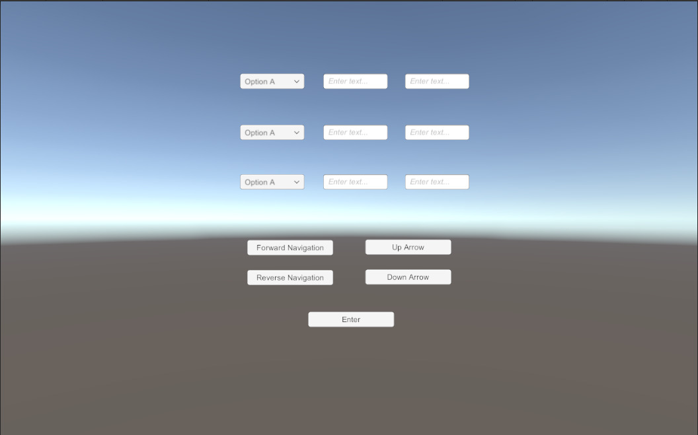

### Introduction

Tab Navigation is a Unity project that demonstrates how to move focus on user interface elements programamtically. Currently text boxes and drop downs are supported. The project is based on the [EasyTab](https://github.com/dav-sea/EasyTab) project. The project contains two Unity scenes, which demonstrate the project.

### Benefits

Unity does not have a built in solution for moving focus on user interface elements programmatically. For example if we need to move focus from one text box or drop down to the next by pressing a button, Unity does not provide support for this. It is possible to implement programmatic navigation of user interface elements in Unity but it requires some effort. Programmatic navigation of drop downs requires further effort.

The Tab Navigation package allows programmatic navigation of text boxes as well as drop downs. It would be useful in applications that do not support keyboard and which require changing focus on the click of a button. See the above screenshot.

### Limitations

The Tab Navigation project has not been tested with Unity 6.

### Features

The Tab Navigation project provides scripts that allow forward navigation, reverse navigation and navigating over the elements of a drop down box.

### Installation

- Go to [EasyTab Unity package release page](https://github.com/dav-sea/EasyTab/releases). Download the Unity Package file. e.g EasyTab-1.3.1.unitypackage
- Create a new Unity project
- Import the Unity Package file. (right click Assets. import package -> custom package)
- Clone the [Tab Navigation source code repository](https://github.com/pakjiddat/Tab-Navigation.git)
- Create Scripts folder inside your project and import the files: CustomDropdown, DownArrow, Enter, ForwardNavigation, ReverseNavigation and UpArrow from the Assets -> Scripts folder of the repository

### Usage

- Set input field that should have focus at the start. This can be done by clicking on EventSystem and then dragging the input field over the "First Selected" property
- Create the user interface for your scene. It should consist of text boxes, drop downs and navigation buttons. See the above sceenshot
- Attach EasyTab script to all navigation buttons. Set "Selectable Recognition" property to "As not selectable" from the script properties
- Attach the imported scripts to the navigation buttons. i.e DownArrow.cs, Enter.cs, ForwardNavigation.cs, ReverseNavigation.cs and UpArrow.cs
- Attach CustomDropdown.cs script to all the drop downs in the scene
- Set the selectable color of each text box and drop down from the properties inspector. This step is optional
- The next and previous Selectable can be configured for each text box and drop down. To configure the next and previous Selectable, Attach EasyTab script to the drop down or text box. Set the Jumping Policy to "Use only jumping" and then drag the drop down or text box to the Next Jump and Reverse Jump fields

### Licence
The Tab Navigation project is available under the **MIT licence**. You may use the application source code in your own projects.