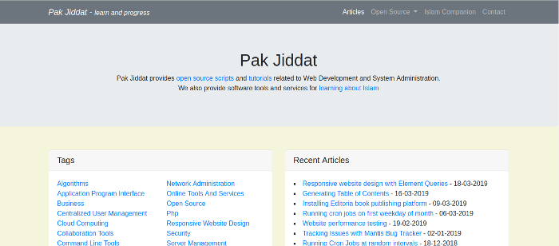

### Introduction
The **Developers Site** project is a simple website that displays articles. It is suitable for developers who need a platform for publishing their work.

### Development of the website
The website was developed by following the [Lean Startup principles](http://theleanstartup.com/principles). The book [Understanding Software](https://www.packtpub.com/business/understanding-software) was an invaluable guide in the development of the website.

### Features
* The website allows publishing articles
* Table of contents are auto generated for articles with headings
* Comments can be posted to articles
* Contact form can be used to send a message to the website owner
* The website has a search box for searching articles
* List of recent articles and categories is auto generated
* The source code is modular and easy to extend with new features
* The website frontend is based on [Twitter Bootstrap](https://getbootstrap.com/) and [JQuery](https://jquery.com/)
* The website frontend is valid HTML5 and has been tested with the [validator.nu](https://validator.nu/) tool
* The article structure is based on [Semantic Elements](https://www.w3schools.com/html/html5_semantic_elements.asp) and is SEO friendly
* The website is mobile friendly
* The website has good browser response time
* Google Analytics tracking code can be easily added for keeping track of website visitors
* The website provides scripts for generating Site Maps and for testing the website pages for broken links and HTML 5 validation errors

### Limitations
* The website does not have a backend. Article content has to be added directly to database using a database management tool such as [PhpMyAdmin](https://www.phpmyadmin.net/)

### Requirements
The "Developers Site" is based on Php and MySQL. It uses the [Twitter Bootstrap](https://getbootstrap.com/) and [JQuery](https://jquery.com/) Frontend libraries. The website uses the [Mail](https://pear.php.net/package/Mail/) and [Mail Mime](https://pear.php.net/package/Mail_Mime/) pear packages for sending email. These packages should be installed on your server.

Installing the website on your own server requires Php 7.2 and above. The website source code is based on the [Pak Php Framework](/posts/pak-php-framework). The source code is fully commented and compliant with the [PSR-2 coding guidelines](https://www.php-fig.org/psr/psr-2/). The source code for the website is modular and easy to extend with new features.

### Site Map Generation
A Site Map for the website pages can be auto generated by running the command: **php index.php  --application="pakjiddat" --action="Generate Site Map";**. This creates a file sitemap.txt in the data folder. The script also saves all urls to the **pakphp_test_data**, which allows each url to be checked for broken links and HTML 5 compatibility.

### Markdown file Generation
The website content stored in database can be exported as markdown files by running the command: **php index.php --applicaiton="pakjiddat" --action="Generate Markdown";**. This creates markdown files in the data/markdown folder.

### Testing
All pages on the "Developers Site" website can checked for broken links and validated using the [validator.nu](https://validator.nu/) tool. To test the website pages, first enter the list of URLs to test in the database table: **pakphp_test_data**. The table may be auto populated by setting the variable: **save_ui_test_data** to **true** in **pakjiddat/config/Test.php** file. Alternately the Site Map script may be run, which saves all Site Map urls to the database table. Next run the command: **php index.php  --application="pakjiddat" --action="Unit Test";**. This will start the testing of each page listed in the database table.

### Installation
The following steps can be used to install the "Developers Site" project on your own server:  
* Download the [source code](https://github.com/nadirlc/developers-site/archive/master.zip) from GitHub
* Move the source code to the document root of a virtual host
* Create a database and import the contents of the file: **pakjiddat/data/developers-site.sql** to the database. Note down the credentials used for connecting to the database
* Enter the database credentials in the file **pakjiddat/config/RequiredObjects.php**
* In the file: **pakjiddat/Config.php**, on **line 41** enter the domain names that will be used to access the website
* Customize the following variables in the file: **pakjiddat/config/General.php**. **$config['app_name'], $config['dev_mode'] and $config['site_url']**
* Customize the variables in the file: **pakjiddat/config/Custom.php**. The comments explain what each variable is used for
* Set the **$config['pear_folder_path']** variable in the file: **pakjiddat/config/Path.php**. The variable should be set to the path of the [pear](https://pear.php.net/) installation.
* Visit the website in a browser
* Enter the website articles in the database table: **home_content**. The article should start showing on the website
* The layout and text of the website can be edited in html files inside the folder: **pakjiddat/ui/html**. For example to edit the website header, the file: **pakjiddat/ui/html/base/header.html** needs to be edited
