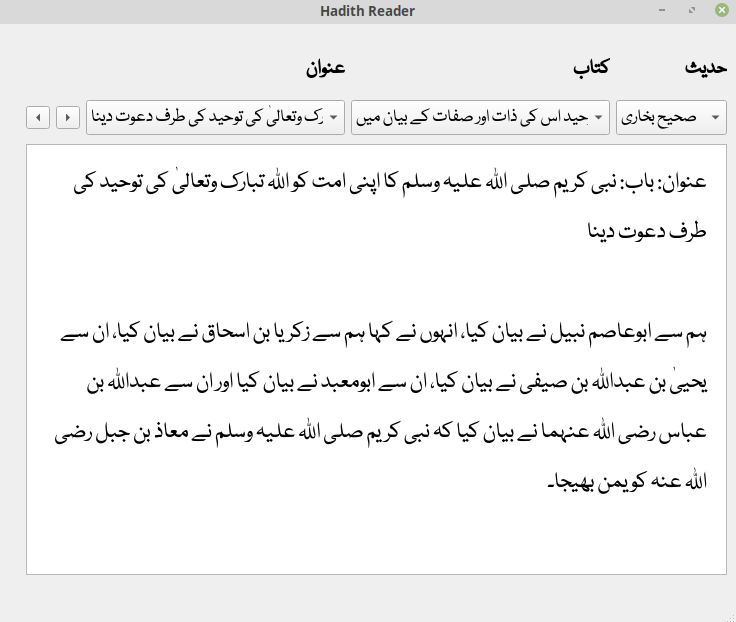

### Introduction

The **Islam Companion Desktop Reader** project is a desktop application. It is availabe as a snap application on [Ubuntu Store](https://snapcraft.io/islamcompanion). It allows users to read Holy Quran and Hadith. It provides two applications. A Hadith reader and a Quran reader.

### Features

The Quran text can be read in 43 languages. These are: **Amharic, Arabic, Azerbaijani, Bosnian, Bengali, Bulgarian, Amazigh, Czech, German, Divehi, Spanish, English, Persian, French, Hindi, Hausa, Indonesian, Italian, Japanese, Korean, Kurdish, Malayalam, Malay, Dutch, Norwegian, Portuguese, Polish, Russian, Romanian, Swedish, Somali, Sindhi, Albanian, Swahili, Turkish, Tajik, Tamil, Tatar, Thai, Uzbek, Urdu, Uyghur and Chinese.**.
  
Hadith text can be read in Urdu, English and Arabic languages.

### Limitations

The Islam Companion Desktop Reader has the following limitations:

* The text for some languages may be difficult to read because of font size.
* The hadith text in English language is a rough translation and may contain grammatical errors.

### Installation
The Islam Companion Desktop Reader application may be downloaded from the Ubuntu Snap Store.

### Development

For details on how to develop the Islam Companion Desktop Reader application refer to the [GitHub repository](https://github.com/pakjiddat/islam-companion-desktop-reader) for the project.

### Acknowledgements

The purpose of the Islam Companion Desktop Reader project is to allow users to read the Holy Quran and Hadith text in their own language.

The following resources were used in the development of the project:

* Translations of the Quran were obtained from: https://tanzil.net/trans/
* Translations of the Hadith were obtained from: http://www.hadithcollection.com/downloads.html
* Icons were obtained from: https://www.iconfinder.com/
* Banner image was obtained from: https://pixabay.com/
* Language fonts were obtained from:
  * Persian and Uyghur: https://fontlibrary.org/en/font/xb-shafigh
  * Sindhi: https://fonts2u.com/zaheer-sindhi.font
  * Amharic: https://www.metaappz.com/References/Amharic_Fonts.aspx
  * Divehi: https://www.fontspace.com/mv-dawlatulislam-font-f22932
  * Kurdish: https://www.kurdfonts.com/font-info/609
* The quran and hadith readers were developed using the PyQt5 framework. The applications were developed in Python language and use Sqlite3 for the database.

To report bugs or make feature requests, post an [issue](https://github.com/pakjiddat/islam-companion-desktop-reader/issues). Constructive feedback is most welcome !.

### Licence 

The Islam Companion Desktop Reader project is available under the **MIT licence**. You may use the application source code in your own projects.
