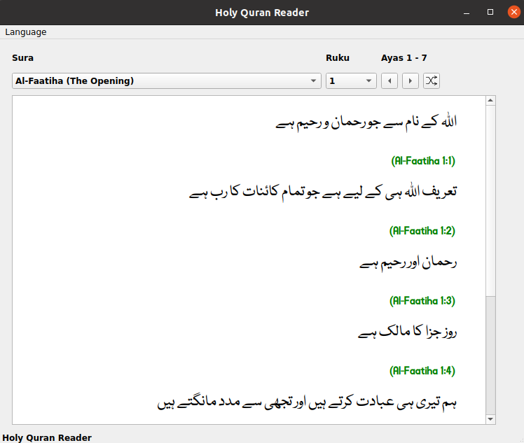

### Introduction
The "**Islam Companion Desktop Reader**" project is a desktop application for the Linux operating system. It allows users to read Holy Quran and Hadith.

### Features
The Islam Companion Desktop Reader has the following features:

* It provides a reader that displays Holy Quran verses
* It provides a reader that displays Hadith text
* The source code is available under [GPL License](https://github.com/nadirlc/islam-companion-desktop/blob/master/LICENSE)
* The source code is written in Python language. It is well commented, modular and easy to update
* The source code can be run on any operating system that supports Python and the Qt graphical framework. It should run without problems on Linux, Windows and MacOS
* Binary executables files are provided for 64 bit Linux operating systems

### Limitations
The Islam Companion Desktop Reader has the following limitations:

* The Quran text is in Urdu language only. Support for more languages is planned
* The Hadith text is in Urdu language only. Support for more languages is planned

### Requirements
The Islam Companion Desktop Reader requires Python 3. It also requires the [PyQt5 framework](https://pypi.org/project/PyQt5/)

### Running the application
The following steps can be used to run the "Islam Companion Desktop Reader" application on a 64 bit Linux desktop:

* Download the [executable files](https://islamcompanion.pakjiddat.pk/islamcompanion/data/ic-desktop-reader.tar.bz2)
* Extract the downloaded file. This will produce the two files: **ic-desktop-hadith** and **ic-desktop-quran**. Make these files executable using the **chmod+x** command
* Copy the executable files to **/usr/bin** folder
* Download the [quran database](https://islamcompanion.pakjiddat.pk/islamcompanion/data/holy-quran.db.tar.bz2) and [hadith database](https://islamcompanion.pakjiddat.pk/islamcompanion/data/hadith.db.tar.bz2). Extract the files and copy the **db** files to the folder: **/usr/share/ic-desktop-reader/**
* Start the quran reader using the command: **ic-desktop-quran**
* Start the hadith reader using the command: **ic-desktop-hadith**
* Create desktop launchers for easily starting the applications

Alternately the Desktop Reader application may be downloaded from the Ubuntu Snap Store.

### Building the source code
The following steps can be used to build the "Islam Companion Desktop Reader" application on your own computer:

* Create a virtual environment for the application using the command: **virtualenv islam-companion**
* Import the virtual environment variables using the command: **source bin/activate**
* Create a folder called source within the islam-companion folder
* Download the [source code](https://github.com/nadirlc/islam-companion-desktop-reader/archive/master.zip) from GitHub. Copy the source code to the source folder    
* Install the PyQt 5 framework using the command: **pip install PyQt5**
* Install the Islam Companion Desktop API using the command: **pip install ic-desktop-api**        * Download the [quran](https://islamcompanion.pakjiddat.pk/islamcompanion/data/holy-quran.db.tar.bz2) sqlite database. Extract the downloaded file to **source/quran/data/holy-quran.db**
* Download the [hadith](https://islamcompanion.pakjiddat.pk/islamcompanion/data/hadith.db.tar.bz2) sqlite database. Extract the downloaded file to **source/hadith/data/hadith.db**
* Run the quran reader using the command: **python quran.py**. The command should be run from the source/quran folder
* Run the hadith reader using the command: **python hadith.py**. The command should be run from the source/hadith folder
