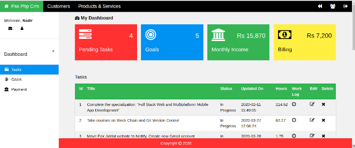

### Introduction
Pak Php CRM is a simple web based task management application. It can be used by web developers to keep track of tasks, income, billing, goals and more.

Pak Php CRM is written in PHP language and uses MySQL for storing data. It is based on the [Pak Php Framework](/posts/pak-php-framework).

### Features
The main idea behind the Pak PHP CRM is to provide a simple application for managing basic developer tasks such as task management, time tracking, project management etc. The application can be easily customized. The idea is to allow developers to create simple applications quickly using form and table widgets.

* The Pak PHP CRM allows time tracking, management of tasks, goals, income, billing, loans, products and services, customers and projects
* It allows user management
* It can easily be extended with more features
* The website front-end is based on [WC.CSS](https://www.w3schools.com/w3css/default.asp)
* The website back-end is written in PHP
* The website is mobile friendly
* The website has good browser response time

### Requirements
The Pak Php CRM is based on PHP and MySQL. Installing the website on your own server requires Php 7.2 and above. The website source code is based on the Pak Php Framework. The source code is fully commented and compliant with the PSR-2 coding guidelines. The source code for the website is modular and easy to extend with new features.

### Installation
The following steps can be used to install the Pak Php CRM application on your own server:

* Download the [source code](https://github.com/nadirlc/pak-php-crm.git) from GitHub
* Move the source code to the document root of a virtual host
* Create a database and import the contents of the file: **crm/data/pak-php-crm.sql** to the database. Note down the credentials used for connecting to the database
* Enter the database credentials in the file **crm/config/RequiredObjects.php**
* In the file: **crm/Config.php**, on **line 41** enter the domain names that will be used to access the website
* Customize the following variables in the file: **crm/config/General.php. $config['app_name'], $config['dev_mode'] and $config['site_url']**
* Set the **$config['pear_folder_path']** variable in the file: **crm/config/Path.php**. The variable should be set to the path of the pear installation.
* Visit the website in a browser
