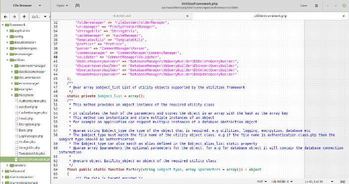
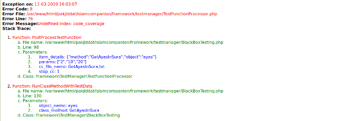
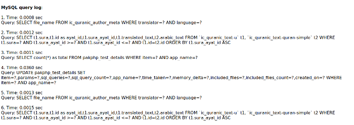

### Introduction
The Utilities Framework is a set of PHP libraries that provide functions such as error handling, logging, emailing, fetching web pages, script profiling, database abstraction, encryption, template engine and more. It requires PHP 7.2 and above. The libraries are easy to use and can be used with custom applications and PHP Frameworks.

The Utilities Framework code is fully commented and compliant with the [PSR-2](https://www.php-fig.org/psr/psr-2/) coding guidelines.

### Features
The Utilities Framework has the following features:

1. #### Database Management
It provides functions for working with Databases. It consists of a Query Builder, Database Cache Manager and Database Log Manager. It also provides a Database MetaQuery Runner and Database Transaction Manager, based on [PDO](http://php.net/manual/en/book.pdo.php)
2. #### Method Validation
This allows validating method parameter values against information in the method's Doc Block comments. This feature is provided by the [Comment Manager](/posts/comment-manager) package.
3. #### Error Management
It allows application errors to be displayed using HTML template files. The template files can be easily customized. Default template files are provided for displaying formatted error messages for the browser and the command line
4. #### File and Folder Management
It provides functions for fetching URL contents, checking if network connection works, searching for files with a folder and copying folder contents recursively
5. #### Email Handling
It provides functions for sending email in plain text format and HTML format with file attachments. It is based on the [Pear Mail](https://pear.php.net/package/Mail/) library and hence supports sending email using SMTP server, PHP mail function and Sendmail library    
6. #### Log Management
It provides functions for saving and updating log data to database. It uses the PDO library for saving data and hence allows log data to be saved to all the databases that are supported by PDO
7. #### Template Engine
It provides a template engine that allows separating the HTML layout code from the data. It also allows templates to be built recursively. This means that a template can consist of one or more templates, which can contain more templates. This allows complex website layouts to be divided in to simple layout files that are automatically combined by the template engine
8. #### Encryption
It provides function for encryption and decryption data using the new [LibSodium library](http://php.net/manual/en/book.sodium.php), which is part of PHP >=7.2
9. #### String Utilities
It provides functions for exporting data to RSS format, converting relative URLs to absolute, checking if string is valid JSON, HTML or Base64 encoded and more
10. #### Profiler
It allows the memory usage and execution time to be measured between function calls
11. #### Cache Manager
It allows data to be stored in a cache. It supports memory cache and database cache
12. #### Authentication
It provides functions for authenticating users using HTTP digest authentication

The following screenshot shows the error message displayed by the error handler component:



The following screenshot shows the MySQL query log displayed by the error handler component as part of the error:



### Installation
* Run the command: **composer require nadirlc/utilities-framework** (installation using Composer) **OR**
* Run the command: **git clone https://github.com/pakjiddat/utilities-framework.git** (Download from [GitHub Repository](https://github.com/pakjiddat/utilities-framework))

### Usage
All components of the Utilities Framework can be accessed using factory functions. To use a feature, we need to first create an object of the relevant component. For example: **UtilitiesFramework::Factory("email", $parameters);**. To send an email the following code can be used:

```php
/* The Email class requires Mail and Mail_Mime pear package */
include_once ("Mail.php");
include_once ("Mail/mime.php");

/* Change the from and to emails to your email address */
$from_email       = "nadir@dev.pakjiddat.pk";
$to_email         = "nadir@dev.pakjiddat.pk";
/** The parameters for the email object */
$parameters       = array("params" => "", "backend" => "mail");
/* The Email class object is fetched */
$email            = UtilitiesFramework::Factory("email", $parameters);
/** The email is sent */
$is_sent          = $email->SendEmail($from_email, $to_email, "Utilitiesframework Test",
                        "<h3>test html content</h3>",
                        null,
                        array("file-path")
                    );
/** If the email was sent, then information message is shown */
if ($is_sent) echo "Email was successfully sent";
else echo "Email could not be sent";
```

### Examples
The **/examples** folder contains example usage for each component.
