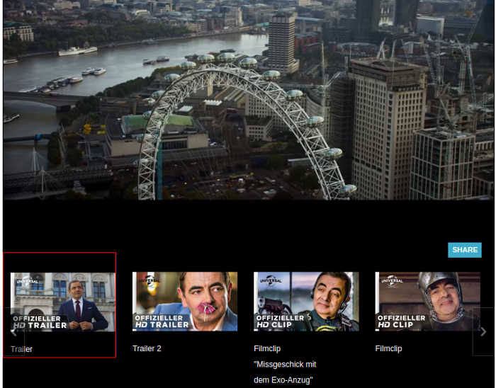

### Introduction
The YouTube Playlist is derived from the [MediaElement player](http://mediaelementjs.com/). It allows YouTube videos to be displayed in a playlist.

### Features

* Allows playlist information to be loaded from XML file
* Allows video quality to be set
* Provides option for sharing video on social networks
* The start and end time for each YouTube video can be specified in XML file. It allows unnecessary parts of the YouTube video to be excluded
* Allows switching to next and previous tracks
* Provides a loop option for playing a track repeatedly
* Provides a shuffle option for playing a random track
* Can be used under the terms and conditions of the [Media Element Player license](https://github.com/mediaelement/mediaelement/blob/master/LICENSE)

### Development of the player
The YouTube Playlist was developed by modifying the MediaElement [Playlist plugin](https://github.com/mediaelement/mediaelement-plugins/blob/master/docs/playlist.md) and the [Quality plugin](https://github.com/mediaelement/mediaelement-plugins/blob/master/docs/quality.md).

Minor changes to the MediaElement Player were also made. The article [Mediaelements: Add a share button to video elements using jQuery](https://xparkmedia.com/blog/mediaelements-add-a-share-button-to-video-elements-using-jquery/) was used to add Social Sharing buttons to the player. The player also uses the [jQuery thumbnail scroller](http://manos.malihu.gr/jquery-thumbnail-scroller/) library for the scroll-able playlist.

### Installation
Download the source code by running the command: **git clone https://github.com/pakjiddat/youtube-playlist.git**. Place the source code in a virtual host directory, so that the **index.html** file is served by a web server. Navigate to the index.html file in a browser. You should see this [screen](#youtube-screen).
