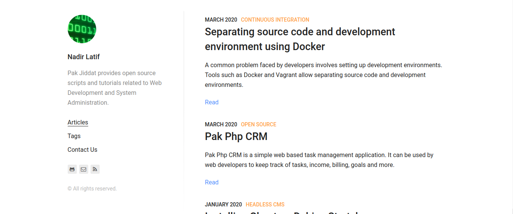

### Introduction
[Gatsby](https://www.gatsbyjs.org/) is a modern framework for developing websites. It requires knowledge of the React JavaScript framework and Node.js. Gatsby uses an innovative approach toward developing websites which is quite different from the common website development workflow.

The main benefit of using Gatsby is that is provides a clean separation of all the steps involved in web site development. Each step in the web development cycle is well documented and easy to implement. For example website data is fetched using the GraphQL query language. The website front-end is implemented using React components. Website optimization is accomplished using web pack. Gatsby also provides a continuous integration workflow and supports static site hosting services such as [Netlify](https://www.netlify.com/). Netlify has a free plan which allows free hosting of static websites.

Gatsby websites are developed using React framework. Once a website has been developed, it is deployed as static HTML pages. The websites pages are loaded dynamically using JavaScript.

I decided to migrate my web development blog to Gatsby mainly because of the learning experience and also to save cost. My blog was based on a custom made PHP Framework. The blog worked well, but was difficult to update and also was expensive to host.

It seemed to me there is no reason to pay for hosting a blog, when you can host one for free. I decided to switch to Gatsby because it provides an innovative approach towards web development and also because it produces static websites, which can be hosted for free.

Gatsby provides a component based, declarative approach towards website development, which is a refreshing change from the procedural approach commonly used for developing websites. Usually when developing websites, we need to be concerned with the low level details of each feature. With Gatsby, we can add features easily by simply installing and configuring pre-built components.

### Installation
The [Gatsby Quick Start guide](https://www.gatsbyjs.org/docs/quick-start/) describes how to install Gatsby. Gatsby is installed as a Node.js package from the command line using:

```bash
npm install -g gatsby-cli
```

To create a new site, enter the command:

```bash
gatsby new gatsby-site
```

We may specify a starter template in the above command. Gatsby has hundreds of [starter templates](https://www.gatsbyjs.org/starters/) that can be used as a starting point for creating a website. Next start a development server by entering the command:

```bash
gatsby develop
```

This will start a development server on port 8000. You should be able to access the website on: http://localhost:8000. If you edit any files in the **src/pages** folder, It will cause the website to automatically reload in the browser and reflect the changes made to the files. Once the website has been developed it can be deployed as static HTML files using the following commands:

```bash
gatsby build
gatsby serve
```

The first command will generate static HTML files, while the second command will start a web server for serving the files. The [Gatsby Tutorial page](https://www.gatsbyjs.org/tutorial/) provides useful tutorials for getting started with Gatsby web development.

### Gatsby plugins
Gatsby has hundreds of [plugins](https://www.gatsbyjs.org/plugins/) that can be used to add features to your website. For example there are plugins for adding sitemap functionality, table of contents, SEO, Authentication, data loading and transformation, Pagination, Forms, RSS Feeds, Comments and more. Gatsby plugins are installed as NPM modules from the command line. Each plugin has its own configuration details.

### Loading data
Data can be loaded to a Gatsby site by using the Gatsby CreatePages API or by using GraphQL. Small sites should use the CreatePages API, while large sites should consider using GraphQL. GraphQL was developed by Facebook and is the most common method used for loading data into React components.

Gatsby can load data from different sources, such as MarkDown files, WordPress, Headless CMSs and more.

### Website Deployment
Gatsby provides support for deploying to different static site hosting providers. The [Gatsby Deployment and hosting guide](https://www.gatsbyjs.org/docs/deploying-and-hosting/) lists all the hosting providers supported by Gatsby.

To deploy a Gatsby site to [Netlify](https://www.gatsbyjs.org/docs/deploying-to-netlify/), we need to first commit the website to a Git Hub repository. Next we need to sign-up for a Netlify account. After that we need to create a new site in Netlify and connect the site with our Gatsby repository. The site should have a unique name.

Once the repository is connected to our Netlify site, the site is built by Netlify and then deployed to a Content Delivery Network (CDN). The website should now be accessible on the URL: https://your-site.netlify.com.

Netlify automatically provides HTTPS for the website. Every time we make a commit to the Git Hub repository, Netlify builds the Gatsby site and deploys the static content to its Content Delivery Network (CDN). This provides a continuous integration approach for developing the website.

### Conclusion
In my opinion Gatsby is an excellent option for hosting blogs. It is well suited for use by web developers. It provides an innovative approach to website development which is quite different from that used by frameworks such as LAMP (Linux, Apache, MySQL, PHP) and ASP.net. It cleanly separates the main web development tasks. It is well documented and has an active open source community.
