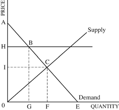

### Introduction

I took the [Microeconomics](https://www.coursera.org/learn/microeconomics) course on [Coursera](https://www.coursera.org/) and found it useful. The following are some of the things I learned from the course.

Supply and demand are two important principles in Economics. In this article I will first describe the principles of supply and demand. Next I will describe some daily life events where these principles can be applied.

### Law of supply
According to Wikipedia the [law of supply](https://en.wikipedia.org/wiki/Supply_(economics)) states that assuming all other factors are constant, an increase in the price of items supplied leads to an increase in quantity supplied.

### Law of demand
According to Wikipedia the [law of demand](https://en.wikipedia.org/wiki/Demand) states that assuming all other factors are constant, an increase in the price of items leads to a decrease in quantity demanded.

### The supply curve
The supply curve shows the variation of item price (y-axis) and quantity supplied (x-axis). The term "supply" refers to the state of the supply curve and is different from quantity supplied. For example if the supply of an item goes up, then for the same price, the quantity supplied is more. Hence the supply curve shifts to the right. If the supply decreases, then for the same price the quantity supplied is less. Hence the supply curve shifts to the left.

### The demand curve
The demand curve shows the variation of item price (y-axis) and quantity demanded (y-axis). This term "demand" refers to the state of the supply curve and is different from quantity demanded. For example if the demand for an item goes up, then at the same price the quantity demanded is more. Hence the demand curve shifts to the right. If the demand decreases, then for the same price the quantity demanded is less. Hence the demand curve moves to the left.

### Why is it so hard to find good math and science teachers

#### Question
One of the major problems in public education is the shortage of science and math teachers. Could we explain this shortage using the supply and demand model?.

Remember that everything has a cost. The opportunity cost of your time working as a teacher is the salary you could make working somewhere else.

Use supply and demand to show how the higher opportunity cost for math and science teachers creates a shortage of them. 

#### Answer
A higher price implies that there is more competition and teaching standards for math and science teachers goes up and hence there are fewer people who can meet the new standards. As a result there is a decrease in the supply of math and science teachers. This could be prevented by reducing the opportunity cost for math and science teachers.

### Where did all the farmers go

#### Question
In the 1950's about 17% of the labor force in the U.S. worked on farms. More than fifty years later, in 2004, that percentage was only 3%. What happened? Why did people stop farming in the U.S.? One explanation has to do with increases in productivity in farming.

Use supply and demand to explain how increases in productivity in farming creates an incentive for farmers to leave farming.

#### Answer
Increase in productivity implies improvement in technology. This results in a right shift of the supply curve. It means that at the same price the quantity supplied is more, which implies that the cost of production decreases. A decrease in cost of production means that laborers are payed less. Hence fewer people will want to work on farms.

A lower cost of production implies it costs less to produce and hence the price of items sold by farmers would decrease. A decrease in price would mean farmers will earn less income. Hence they would be encouraged to leave farming.

### Why are people moving back downtown

#### Question
In the U.S. people are moving back downtown. Cities such as Chicago have seen a boom of residential real estate development in their downtown areas.

Interestingly enough, one reason may have to do with the increase in online shopping. As people continue to get their shopping done online, large retailers have been closing their stores in the downtown areas. This has increased the availability of real estate in those areas.

Use supply and demand to explain how the increase in online shopping has created an incentive for people to move back downtown.

#### Answer
An increase in online shopping would mean there is less demand for retail shops. As a result the prices of items sold at retails shops will increase. This will further discourage people from buying from retail shops.

Fewer retails shops implies more space for buildings such as schools, residential buildings, offices etc. This will encourage more people to move downtown.

An increase in residential buildings usually means a decrease in house prices. A decrease in price results in an increase in quantity demanded. So more there will be more incentive for people to move downtown.

### Why would more drug enforcement of illegal drug lords lead to more crime

#### Question
For the last 40 years, the U.S. has been fighting a war against illegal drugs. The goal of this "war" has been to reduce the supply of these drugs coming to the country by either seizing the drugs or by incarcerating those involved in the illegal market. Paradoxically, many argue that this increase in enforcement has led to an increase in the crime associated with the use and distribution of these drugs. Why?

Use supply and demand to explain how an increase in drug enforcement could lead to an increase in crime.

#### Answer
If the supply of drugs decreases, then the supply curve would move left. A decrease in the supply of drugs means people will be willing to pay more for drugs. So the price of drugs will increase. Less users will be able to pay for drugs so people will be more likely to commit crimes in order to pay for drugs.

### Why has the price of oil increased in the last 10 years. Or has it

#### Question
In 1994, the average cost for a gallon of gasoline in the U.S. was $1.21. These days, the same gallon of gasoline goes for about $3.40. On the one hand, we could explain this increase in price to a larger demand for gasoline, particularly from rapidly growing countries such as India and China. On the other hand, if gasoline was, in fact, so expensive, we would see smaller and more efficient cars on the street, but we have not. 

I drive a 2011 Honda CRV that gives me an average of about 25 miles per gallon (MPG). The same model in 1995 gave you, are you ready just about the same: 25 MPG. Studies have shown that from 1975 to 1980, the average vehicle weight in the U.S. dropped almost 1,000 pounds, from 4,060 lbs. to 3,228 lbs. By 2005 those reductions had all been gained back, and the average car was as heavy as it was in 1975. If the price of gasoline is higher, why are people driving bigger and less efficient cars?

Use supply and demand to explain why people in the U.S. are driving larger and less fuel efficient cars today if the price of gasoline has continued to increase.

#### Answer
An increase in cost of gasoline, would mean that it costs more to produce and deliver cars. The quantity supplied for cars will decrease. If fewer cars are being supplied, then in order to consume the available gasoline, the average vehicle weight can be increased. This may explain why people are driving bigger and less fuel efficient cars.
